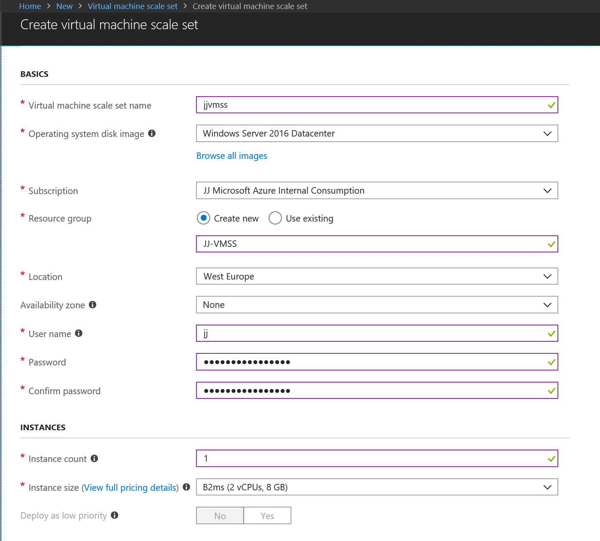
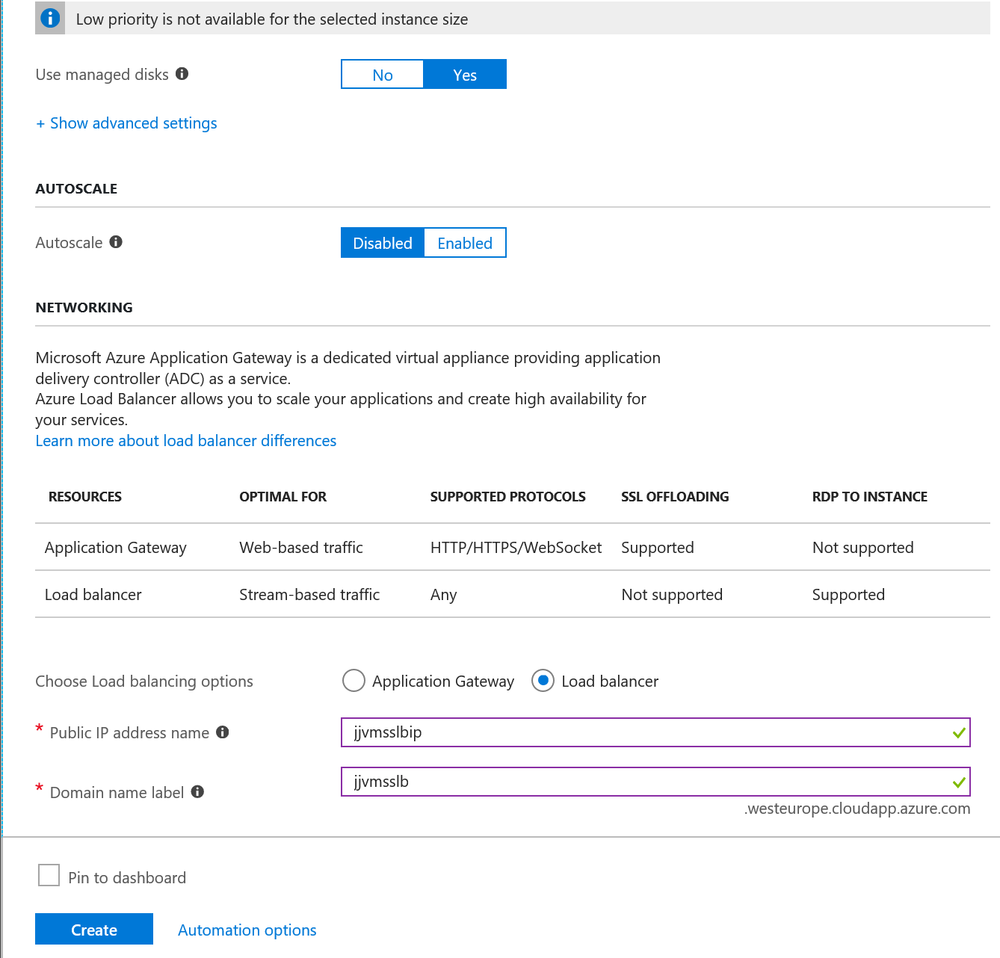
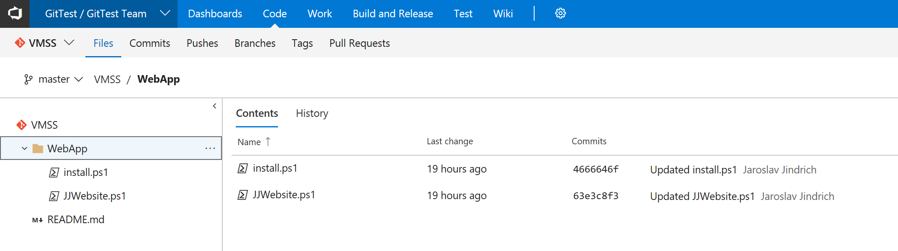
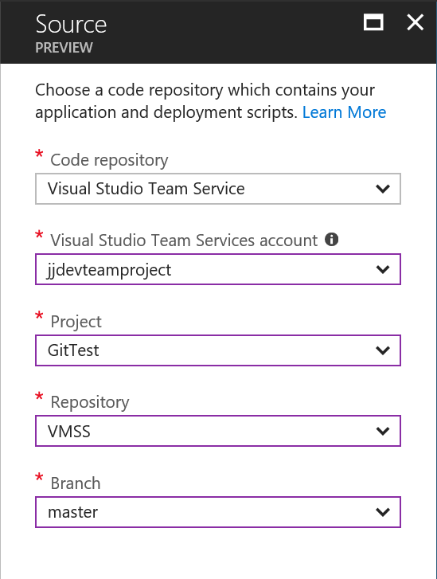
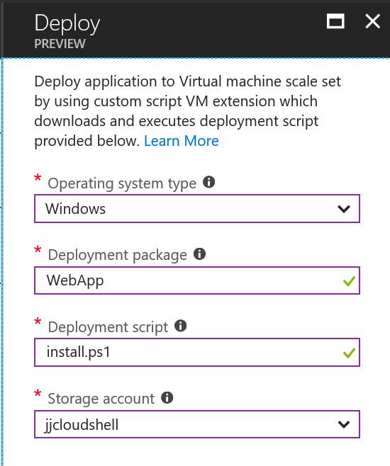
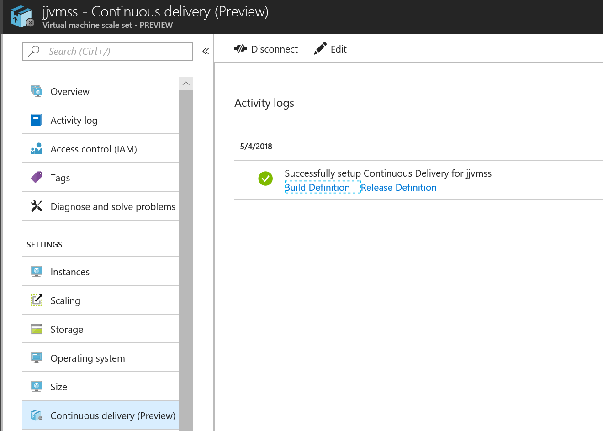
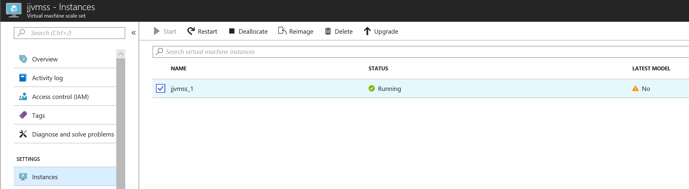
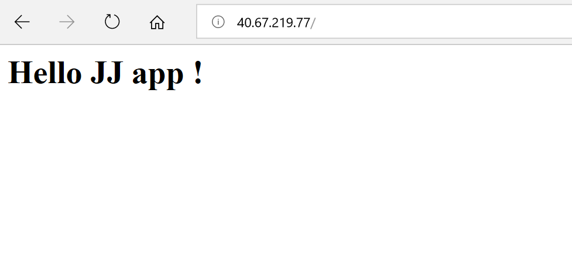

# JJ Azure VSTS CI/CD pipeline for Azure VMSS

Azure Virtual Machine ScaleSet application deployment with VSTS CI/CD (continuous delivery) pipeline.

## Create new Azure VMSS

Create new Azure VMSS Windows 2016 from Azure portal with load balancer.




Wait for successfull provisioning, check intances are green and on latest model.

## Prepare scripts in VSTS Git

Check you have existing VSTS project, my project GitTest on https://jjdevteamproject.visualstudio.com.

Create Git repository, my is named VMSS.

Upload scripts from local folder into git root.


## Configure Continuos delivery for VMSS

Select Azure VMSS and select Continuous Delivery under Settings section. Next click Configure.




Wait for finish Continuous Delivery configuration.


Update VMSS to latest model


Click Upgrade to update VMSS cluster and wait for latest model (Yes).
(VMSS is created as manual upgrade mode via )

## Check running application

Run browser with VMSS ipaddress http://[vmss-ip]

You will get simple homepage.


## Running update

Now you can update script. VSTS will run deployment automatically (Build and Release). Check VMSS, there are instances not updated to latest. Run updade to latest.

If you want to update VMSS to latest model automatically, change Upgrade policy to Automatic.

```bash
az vmss update --set upgradePolicy.mode=Automatic -g <resource group name> -n <vmss name>
```